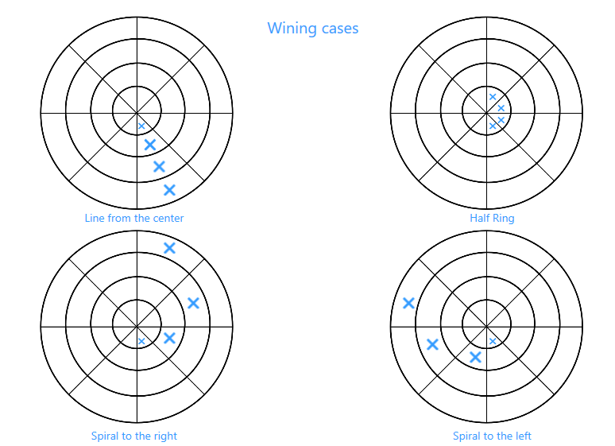
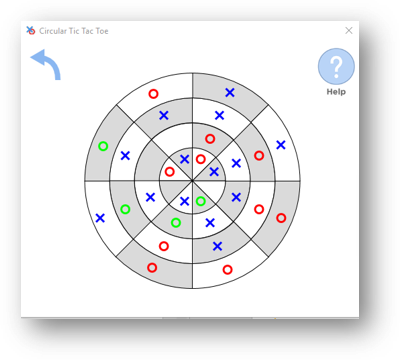

# CircularTicTacToe
A small desktop tic-tac-toe game played on a circle and has a lot of winning cases

## Winning Cases:

## Screenshot from the program:

## Download:

You can download the game from the following link:  
[download](https://drive.google.com/open?id=14wUUJ_mAY8Mg4TI37794a9aXG7vmgumI)

## Development:

To develop the application using visual studio, just create a new solution and add  
an existing project (which is "CircularTicTacToe.csproj")
